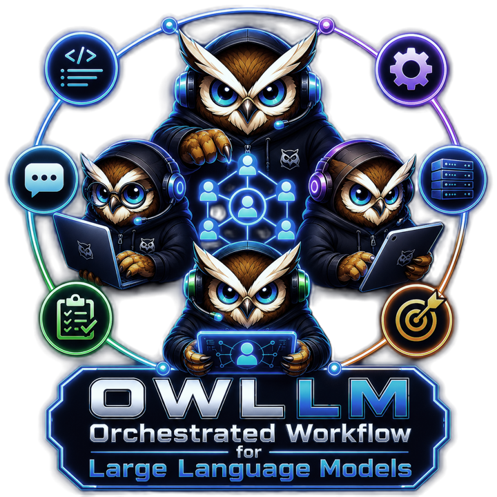
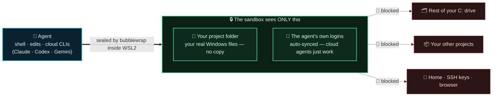

# ⬇ [Download OwLLM for Windows](https://github.com/OwLLM/owllm/releases/latest/download/OwLLM.Desktop.Setup.exe)

### One file · ~30 MB · No admin required · Windows 10 / 11 x64

[-no_install-7e8aa0?style=for-the-badge)](https://github.com/OwLLM/owllm/releases/latest/download/OwLLM-Desktop-Portable.zip)

---

### Your team of AI agents. Build them. Own them. Run them anywhere.

**OwLLM is an open platform to build, deploy, and run custom AI agent teams — on your hardware, your VPS, or in a VM, 24/7. Bring your own models: local, cloud, or both. Fine-tune. Quantize. Abliterate. Red-team. Automate.**

  
  
  
  

> [!IMPORTANT]
> **OwLLM Desktop currently ships for Windows 10/11 (x64) only.** macOS (Apple Silicon + Intel) and Linux (x86_64) builds are coming via the already-configured cross-platform CI. Watch the repo for release notifications.

---

## What makes OwLLM different

Most AI tools give you a chatbox. **OwLLM gives you a workforce.**

You compose teams of specialised agents — an orchestrator that plans, a coder that writes, a critic that reviews, a researcher that fact-checks — and they collaborate on real tasks in parallel. Each team is a graph of roles + prompts you define. The 18 teams shipped in this repo are **starter samples**, not the menu.

| | What OwLLM gives you that others don't |
|---|---|
| 🧩 **Build your own teams** | Compose agents from 8 base roles + custom prompts. Visual graph builder. Hot-updates through this repo — push a team JSON, it lands on every installed app. |
| ☁️ **Cloud OR local — same teams** | No 4090? Plug in Claude / GPT / Gemini / Kimi keys, teams work identically. Have a GPU? Run open-weight models locally and stop paying per token. Mix both in the same conversation. |
| 🎓 **Fine-tune any model** | Full LoRA + Unsloth + TRL pipeline. Drop a JSONL, watch loss curves, save adapters. Works on consumer GPUs (8 GB+). |
| 🔬 **Abliterate for safety research** | Orthogonalise weights against refusal directions. Generate adversarial datasets. Train better safety classifiers. The honest tools the field actually needs. |
| 🛠 **GGUF + quantization built-in** | Convert HF safetensors → GGUF, quantize Q4/Q5/Q6/Q8/F16. Ship custom models anyone with llama.cpp can run. |
| 🛡 **Red-team capable** | Compose adversarial agent teams whose *job* is to find vulnerabilities — in models, code, apps. Pair with fine-tuning to train defenders. |
| 🔒 **Sealed to ONE folder (Win/Mac/Linux)** | Flip it on and every tool your agents run — shell, file writes, edits, search, **and the cloud CLIs (Claude/Codex/Gemini/Kimi)** — runs **inside a real Linux sandbox** (WSL2 on Windows, Lima VM on macOS, bubblewrap on Linux *(Mac/Linux beta)*). Agents are **sealed to ONLY the project folder**: they work on your **real Windows folder — no copy** — but **cannot see the rest of your C: drive, other projects, or your home / SSH keys**. A model that runs `rm -rf` simply has nothing else to reach. Isolated **by default**; the seal and toolchain **auto-install**; provider logins (CLIs **and** API keys) **auto-sync** in so cloud agents just work. **Connect GitHub** to clone/push private repos from inside. See the **🔒 Sealed to one folder** section below for the diagram. |
| 🔌 **MCP-first tooling** | Plug in any Model Context Protocol server (filesystem, git, browser, Postgres, GitHub…). **Keyless DuckDuckGo web search is auto-installed on first run** — no API key, no card. Engine-agnostic: any search MCP you add is used automatically. Curated packs per team. |
| 🏠 **Run anywhere** | Desktop today. **Headless on a $5/mo VPS, 24/7** — on the roadmap. Containerised / VM — on the roadmap. Your agents, your hardware, your terms. |

## 🔒 Sealed to one folder — nothing else

Give an AI agent a shell and it can read your SSH keys, wander into other repos, or `rm -rf` the wrong thing. OwLLM puts a hard wall around that. Turn isolation on (it's the default) and every command runs inside a Linux sandbox that can see **only the project folder you're working on** — your **real** Windows folder, mounted live with **no copy** — and nothing else of your machine.

- **Real folder, no copy** — work on `C:\code\my-repo` directly; changes are immediate, nothing is duplicated, no disk doubling.
- **Keeps working after you seal it** — the agent's Claude/Codex/Gemini logins are bound in, so the team doesn't suddenly ask you to log in again.
- **One toggle, honest feedback** — press **🔍 Verify** and the app runs a probe through the agent's *own* shell and tells you plainly: *runs in WSL? sealed to only this folder?* — and installs the seal if it's missing.

### 💾 …and it cleans up after itself

The sandbox lives in WSL, whose virtual disk only ever grows. A **Sandbox disk** card on the Home page keeps it honest:

| Action | What it does | Cost |
|---|---|:---:|
| **See usage** | WSL disk size + reclaimable caches (uv / npm / pip) + project-copy size, at a glance | — |
| **🧹 Clear caches** | Drops regenerable build caches — never your projects, logins, or models. Often frees **many GB** in seconds | instant, no restart |
| **💿 Reclaim disk** | Physically **shrinks** the WSL disk file and reports exactly how much came back | restarts WSL · admin prompt |

Deleting a project also frees its sandbox copy automatically — your own folders are never touched.

## What teams can do

OwLLM ships starter teams in nine categories. **All of them are forkable and remixable** — they're templates, not the menu. The real product is the team builder.

| Category | What teams here do | Starter samples |
|---|---|---|
| 🛠 **Code** | Architect → code → critic → refactor; bug hunting; reviews | `code_artisan`, `dev_squad`, `code_reviewer`, `bug_hunter` |
| 🔬 **Research** | Multi-source synthesis with real citations, fact-checking | `research_lab`, `learning_tutor` |
| 📊 **Data** | SQL → notebook → viz → narrative | `data_analyst` |
| 🎨 **Design** | Product → UX → tech → critique | `product_studio` |
| ✍️ **Writing** | Outline → draft → edit → SEO → publish | `writers_room`, `social_desk` |
| 🤝 **Ops** | Triage → respond → schedule → digest | `secretary`, `concierge`, `customer_support` |
| 💼 **Personal** | Calendar, finance, health, home automation | `finance`, `health_coach`, `smart_home` |
| 🌐 **Social** | Outreach, support, community management | `sales_outreach`, `n8n_workflow_builder` |
| 🛡 **Safety / Red-team** | Adversarial dataset generation, jailbreak research, refusal probing | *(build your own — see [data/teams/SCHEMA.md](data/teams/SCHEMA.md))* |
| 🎮 **Gamify** | Agent-vs-agent, achievements, arena | *(in progress — Q4 2026)* |

[Browse the 18 starter teams →](data/teams/) · [Build your own →](CONTRIBUTING.md)

## Build your own team — 5-minute walkthrough

1. Open **Studio** in the desktop app
2. Drop in agents: orchestrator + 1..N specialists (coder, critic, researcher, brainstormer, devops, documentation, operator, …)
3. Wire the dispatch graph (orchestrator → coder → critic → back to orchestrator)
4. Write each agent's system prompt
5. Save → team appears in your picker
6. **Publish to the community** via PR against [`data/teams/`](data/teams/) — your team becomes one-click installable for every other user

## Power tools nobody else ships

### Fine-tune any open-weight model
LoRA pipeline with Unsloth, TRL, PEFT, bitsandbytes. Llama / Qwen / Mistral / Gemma — anything on HuggingFace. Live loss curves, graceful Stop preserves checkpoints, resume-from-checkpoint and resume-adapter both supported. Runs on a 12 GB GPU.

### Abliterate (refusal removal for safety research)
Orthogonalise weight matrices against refusal directions — now with **effect-based (causal) selection**: it *measures* refusal on a held-out set, tests candidate directions by actually ablating and re-scoring, keeps the one that drops refusal most, and stops before over-ablating. You get a real before/after compliance number, and it works on strong RLHF models that defeat the classic single-direction recipe. Use cases:
- AI safety labs training refusal classifiers need cleanly-uncensored teacher models
- Red teams need models that don't sandbag jailbreak tests
- Academic research on alignment failure modes

The corpus prep + abliteration script ship together.

### GGUF creation + quantization
Convert HF safetensors → GGUF, quantize to Q4_K_M / Q5_K_M / Q6_K / Q8_0 / F16. The same pipeline that gives you tiny, fast custom models others can run on llama.cpp / Ollama / LM Studio.

### Adversarial dataset generation
Build a team whose role is to PROBE another model. Output: a labelled dataset of jailbreak attempts, refusal patterns, edge cases. Sells to AI safety labs. Trains your own filters.

## Cloud or local — same teams, your choice

You don't need a 4090. Many users will never have one.

- **Cloud-only:** Plug in Claude / GPT / Gemini / Kimi API keys. Teams work identically. ~30 MB install, runs on any laptop.
- **Local + cloud mix:** Have a 3060? Run Llama for the bulk, hand off to Claude for the hard parts in the same conversation. Save 90% on tokens.
- **Local-only:** Have a 4090? Never touch a cloud API. Privacy by default. Stop paying per token forever.

Same teams. Same agent definitions. Same UI. The model layer is just plumbing.

## Run anywhere

| Mode | Status | Use case |
|---|:---:|---|
| **Desktop (Windows)** | ✅ shipped | Daily-driver AI workstation on your laptop |
| **Desktop (macOS / Linux)** | 🔜 Q3 2026 | Mac / Ubuntu users |
| **Headless on VPS (24/7)** | 🔜 Q4 2026 | Run your custom teams on a $5/mo box. Reach them via Telegram, web, API. Always-on agentic services. |
| **Containerised / VM** | 🔜 Q4 2026 | Drop OwLLM into your existing infra. |

The team definitions, role prompts, MCP configs, and model selections are all portable across deployment modes — build a team once, run it anywhere.

## Install (Windows only — for now)

1. **[Download `OwLLM.Desktop.Setup.exe`](https://github.com/OwLLM/owllm/releases/latest)** (~30 MB — one file, that's it)
2. Run `OwLLM-Desktop-Setup-x64.exe`. Windows SmartScreen may flag it the first time (the binary isn't EV-signed yet) — click "More info" → "Run anyway".
3. On first launch, a **hardware-aware wizard** opens. It detects your hardware and offers the modules that fit:
   - **Local Inference** (~33 MB CPU / ~32 MB Vulkan / ~285 MB CUDA) — only needed if you want local models
   - **Audio / Speech-to-Text** (~148 MB) — for voice messages, mic input
   - **Fine-tuning** (~12 GB) — only if you'll train models
   - **MCP toolchain** (~260 MB) — only if you want browser / git / postgres MCP servers

**Cloud-only?** Skip the wizard entirely and just enter your API keys in Settings. The shell alone is enough for cloud-model chat + agent orchestration.

## How updates work

Three independent update streams — small, fast, no full reinstalls:

- **Shell** auto-updates via Tauri's signed updater
- **Modules** (llama backend, fine-tune env, audio, MCP) check + swap per-launch
- **Data layer** (team templates, role prompts, model profiles, MCP recommendations) hot-pulls from `data/` in this repo on launch. **A new team you contribute today reaches every installed app within minutes — no rebuild.**

That's why the data/ tree is open and community-driven even though the app binaries are closed-source.

> 📐 **[How OwLLM's agents are built — design & the science behind it](docs/AGENTIC_DESIGN.md)** — evidence-based architecture (single-agent verify-loops for code, parallel teams for research), with diagrams and cited research.

## ✨ Recent highlights

OwLLM ships fast. Here's what landed across the **0.6.37 → 0.6.81** releases.

### 🧪 Agentic teams, rebuilt on evidence (0.6.78 → 0.6.81)
After a deep, citation-backed review of how agentic systems actually succeed and fail (Agentless, mini-swe-agent, Anthropic's multi-agent research, MAST's failure taxonomy, the "self-correction needs an oracle" results), we rebuilt the team engine around one principle: **an agent never grades its own work.**
- **The Verification Gate** — a first-class, unit-tested check that decides "done" from a **real command's exit code**, never from the model's say-so. Point it at your project's check with a one-line `.owllm/verify.json` (`{"command":"npm run build"}`, or per-lane `frontend`/`backend` commands). No check configured? It honestly reports **"unverified"** — never a false "passed".
- **Per-agent verify-fix loops** — each coder now *edits → runs the gate in its own workspace → on a real failure, takes the captured error and tries again* (bounded; stops early once it stops making progress). The agent is "done" only when the check passes, and the shared team memory records the **real** verify outcome, not the agent's claim.
- **The OWLLM Team** — one adaptive build team that **right-sizes itself**: a one-file fix uses a single coder; a cross-lane feature **locks a shared API contract first**, then builds front-end and back-end together in isolated git worktrees (worktrees stop the lanes clobbering files; the locked contract stops them disagreeing on the shape). Critic reviews what a build can't catch, Red Team tries to break it, Publisher ships the release. One team that scales up or down, replacing five fixed coding teams. *(The full design — diagrams and citations — lives in [`docs/AGENTIC_DESIGN.md`](owllm-desktop/docs/AGENTIC_DESIGN.md).)*

### 🎯 Teams that deliver — and a way to prove it
- **Teams actually ship now** — the orchestrator right-sizes each round, routes code work to a **coder** (never the read-only design leader), enforces strict front-end/back-end layer ownership, and a **Definition-of-Done gate** flags a "code task" that produced zero file changes instead of trusting the model's prose. Universal across **every** team, on every model path.
- **An objective eval harness** — two layers you can run with `node`, no test framework: a **deterministic control-flow judge** that checks routing, task-classification, the critic verdict and the done-gate for **every bundled team** (it already caught and fixed 2 real bugs), and a **live-run scorecard** that records what each run did and grades it against per-team expectations — so you see *which* agent misbehaved, not just *that* something went wrong. Every run ends with a one-line **Run Report** (who ran · wrote files? · critic verdict · done?) with a PASS/FAIL.
- **The big delivery fix (0.6.68)** — multi-line dispatch instructions (a numbered change list, steps, a code block) used to reach the specialist truncated to just the first line, so the team received a header with no actual task and shipped nothing. Now the whole instruction arrives intact, and the end-of-run report no longer claims a task is "done" when a coder was dispatched but wrote nothing.
- **Leaner, more flexible teams (0.6.69)** — with that bug fixed, the prompt scaffolding piled on to *force* delivery was removed: the always-on operating contract is half the size and the orchestrator guide is much shorter, so the model spends its attention on your task, not on reciting rules. Delivery is now enforced by the run diagnostics instead of by browbeating the prompt.
- **Teams that stay in sync (0.6.71)** — the shared team memory now auto-captures what each agent did and feeds the *relevant* slice to the next agent (retrieved by the task, not by recency), so a coder builds on what the backend just shipped instead of redoing it. It records the **work**, not opt-in notes.
- **Smarter & snappier** — fixed a regression that demoted the agent system prompt to plain user text (models "acting dumb"), 20–30 s typing lag over remote, and tool results that falsely showed **"Failed."**

### 🧠 Agentic memory that actually persists
- **Per-agent memory** — every specialist now remembers its own prior turns across dispatches *and* across runs. Model-agnostic (local, Claude, Codex, Gemini, Kimi).
- **Shared team memory (RAG)** — a durable, project-wide knowledge base the whole team pools what it learns into. **Works on every model path now** — a recent-memory snapshot is injected into every agent's prompt, and any agent (cloud CLI or API, not just local) can write a fact with a `[REMEMBER …]` line. **Syncs across your PCs.**
- **3D knowledge graph** — explore that memory as a rotatable force-directed graph: 🧠 *Memory → 🌐 Graph*.

### 📋 A team operating standard
- Projects ship with a **native best-practice rule set** (fully editable) — enforced for every agent **and** the Critical Thinker.
- A standing **operating contract**: a conflict-resolution priority order, a Definition of Done, and an agent handoff format.
- Your rules **sync across machines**.

### 🎓 Skills, by role, out of the box
- A curated set of **skill packs auto-equipped by role** — coder, critic, researcher, writer, orchestrator… Add, remove, or install more (Anthropic / community) per agent.

### ⚡ Local-model performance
- **VRAM-aware context** — the context window is sized to fit your GPU *after* the model weights, so a big model stops silently spilling onto the CPU. Real, measurable speed-ups.
- **Direct-drive file tools** — agents read your project folder straight off the disk instead of a slow WSL round-trip.

### ⏱️ Visibility & reliability
- **Run timers** — a team stopwatch in the canvas header, plus per-agent working-time on every card.
- **No more idle CPU burn / freeze** — the Agents views' animations now run only while agents are working *and* the window is visible, instead of re-rendering forever (which used to peg a core and leak memory until the app locked up).
- **No more orchestrator "crash after a few seconds"** — a large agent system prompt (role + team + memory) was passed as one giant command-line argument and overflowed Windows' ~32 KB limit; large prompts now go through stdin instead, across every CLI provider.
- **Team agents honor auto-approve** — with auto-approve on, dispatched specialists actually get write/exec permission (was gated regardless of the toggle); image paste/drop no longer fails with "Access is denied."
- Hardened the subscription path (transient **401 / 529** auto-retry), the WSL sandbox credentials + folder handling, and post-reboot cold-start hangs.

### 💬 Chat & UI polish
- **Server page tells you what's live** — *Select Model* pre-selects the running model, and the context window in effect shows as a live **● Live: N tokens** badge (read from llama-server) so you never guess what's loaded.
- **Cleaner team diagram** — ring distances are fixed per layer instead of stretched to fill the canvas; a single-layer team no longer flings its ring out to the outer-layer distance.
- **Ctrl+A behaves** — select-all inside a chat now grabs *only* that conversation, not the whole app window. Clean copies again.
- **Live tok/s in the header** — your local generation speed sits next to the API key and updates even through thinking- and tool-heavy turns.
- **No more doubled output** — fixed a race that could run a team's orchestrator twice at once, interleaving two streams into one garbled reply.

<b>Full changelog (0.6.37 → 0.6.81)</b>

| Version | Highlight |
|---|---|
| **0.6.81** | OWLLM Team — one adaptive build team (right-size activation + contract-lock before cross-lane fan-out) replacing five fixed coding teams · "Save as new…" team fork |
| **0.6.80** | Per-agent verify-fix loop — each coder edits→verifies→fixes against the real check; "done" is a passing build, not a self-report |
| **0.6.79** | The Verification Gate — a first-class, unit-tested check that decides "done" from a real exit code (`.owllm/verify.json`); honest "unverified" when none configured |
| **0.6.78** | Ground the loop in execution — real verify gate + bias-to-action + no self-conditioning (evidence-driven redesign) |
| **0.6.77** | Protect Code-page worktrees from the team sweep (no unmerged-work loss) + separate branch namespaces |
| **0.6.76** | Stop fleet worktrees piling up — no worktree for sequential runs + sweep crashed-run orphans |
| **0.6.75** | "Reset team to template" — pull template fixes (e.g. the publisher rename) onto an existing project's frozen roster |
| **0.6.74** | Publisher agent named as such; Info page cards flow at natural heights |
| **0.6.73** | The team ships its own releases — a Publisher role + host-side build/sign/publish/verify pipeline |
| **0.6.72** | Team-memory graph renders — visible connection lines + always-on node labels |
| **0.6.71** | Team memory becomes work-state sync — agents auto-record what they did and read teammates' relevant work; image-save (9P) fix |
| **0.6.70** | Studio agents — built-in roles in their own column, custom agents deduped by name |
| **0.6.69** | Restore the lean, flexible orchestrator — slim the prompt scaffolding that was compensating for the (now-fixed) dispatch bug |
| **0.6.68** | Fix teams unable to deliver — multi-line dispatch instructions were truncated to a header; honest "not done" report |
| **0.6.67** | Objective eval harness for teams — control-flow tests (all teams) + live-run scorecard + in-app Run Report |
| **0.6.66** | A routing test that judges every team — found & fixed 2 task-classification bugs |
| **0.6.65** | Harness-level run control — structured critic verdict · done-gate · oscillation break · routing parity |
| **0.6.64** | Deterministic routing in the harness — code tasks reach a coder, never the design leader |
| **0.6.63** | Tool results stop falsely showing "Failed" (use the real error flag, not word-matching) |
| **0.6.62** | Fix "smart model acting dumb" (system prompt was demoted to user text) + 20–30 s typing lag |
| **0.6.61** | "Stay in your lane" — layer ownership made universal across every team |
| **0.6.60** | Orchestrator right-sizes the round + strict front-end/back-end ownership |
| **0.6.59** | Product Studio fast-path — fix/ship an existing app without the design phase |
| **0.6.58** | Teams DELIVER — action-forcing orchestrator + operating contract |
| **0.6.57** | Land the team's in-repo work (dedupe agents, image-save diagnostics, WSL inbox retry) |
| **0.6.56** | Finish the orchestrator-crash fix for the Codex agent path (all CLI paths overflow-safe) |
| **0.6.55** | Fix orchestrator "crash after a few seconds" — system prompt overflowed the command line (os 206) |
| **0.6.54** | Team agents honor the auto-approve toggle (can write) · fix image-paste "Access is denied" |
| **0.6.53** | Team memory on every model path ([REMEMBER] writes + injected snapshot) · fixed runaway-CPU freeze |
| **0.6.52** | Server page shows the running model + live context · fixed diagram ring distances |
| **0.6.51** | Scoped Ctrl+A in chats · live tok/s in the header · no doubled orchestrator |
| **0.6.50** | Effect-based abliteration — causal selection + refusal benchmark |
| **0.6.49** | Context capped to fit VRAM (stops CPU spill) |
| **0.6.48** | Auto-context sized from free VRAM after the model weights |
| **0.6.47** | Time-bounded WSL warm-up — no post-reboot hang |
| **0.6.46** | Direct-drive file tools + run timers + 529 retry |
| **0.6.45** | WSL pre-flight folder-reachability check |
| **0.6.44** | Agents told their project root explicitly |
| **0.6.43** | 3D memory graph + sandbox-credential 401 fix |
| **0.6.42** | Curated skill packs, auto-equipped by role |
| **0.6.41** | Project rules sync across PCs |
| **0.6.40** | Full Agent Team Rules + operating contract |
| **0.6.39** | Native best-practice rule set |
| **0.6.38** | Team-memory viewer + cross-PC sync |
| **0.6.37** | Per-agent memory + shared RAG team memory |

---

## Roadmap

- [x] Multi-agent dispatch with worktree isolation
- [x] Modular installer + hardware-aware wizard
- [x] MCP-first tool architecture
- [x] Fine-tuning + abliteration pipeline
- [x] GGUF / quantization pipeline
- [x] Telegram bridge
- [x] **WSL tool isolation** — agents run their tools inside Ubuntu, off your Windows drive
- [x] **Folder-sealed isolation** — agents see **only the project folder** (bubblewrap inside WSL), on your **real Windows folder, no copy**
- [x] **Sandbox disk management** — usage view, one-click cache clear, disk reclaim; auto-cleanup on project delete
- [x] **Cloud CLIs inside the sandbox** — Claude/Codex/Gemini/Kimi run isolated too
- [x] **Connect GitHub** — isolated agents clone private repos + push from inside the sandbox
- [x] **Auto login-sync** — codex/claude/gemini/kimi + every API key mirrored into the sandbox
- [x] **Convert projects** isolated↔not from the header; **Accounts tests host + sandbox**
- [~] **Mac/Linux isolation (beta)** — Lima VM (macOS) + bubblewrap (Linux), same model as WSL
- [ ] **Visual team builder** — Q3 2026
- [ ] **macOS + Linux desktop** — Q3 2026
- [ ] **24/7 headless / VPS mode** — Q4 2026
- [ ] **Container / VM deployment** — Q4 2026
- [ ] **Gamification** (agent-vs-agent arena, achievements) — Q4 2026 *(in progress)*
- [ ] **WhatsApp bridge** — Q4 2026
- [ ] **Vision models** (LLaVA / Pixtral) — Q4 2026
- [ ] **Voice output (TTS)** — Q1 2027
- [ ] **Public team marketplace** — Q1 2027

Track active work in [Discussions → Roadmap](https://github.com/OwLLM/owllm/discussions).

## Who's this for

- **Indie devs & founders** — your AI workforce, not a SaaS subscription
- **AI safety researchers** — abliteration, red-team teams, adversarial dataset gen
- **Model creators** — fine-tune, quantize, ship GGUFs
- **Automation builders** — replace n8n / Zapier with agents that understand *meaning*
- **Privacy-bound teams** — legal, medical, defence, regulated industries
- **Agencies** — run custom client agent teams 24/7 (when VPS mode lands)
- **Power users** — anyone tired of generic chatboxes

## Community

- 💬 [GitHub Discussions](https://github.com/OwLLM/owllm/discussions) — Q&A, show what you built, roadmap input
- 🐛 [Issues](https://github.com/OwLLM/owllm/issues) — bug reports (use the template)
- 🎨 [Contributing](CONTRIBUTING.md) — agent teams, roles, translations, docs

## License

Repository contents (agent teams, role definitions, registry, schemas, docs): [MIT](LICENSE) — fork freely, share team packs, build on it.

Application binaries via [Releases](https://github.com/OwLLM/owllm/releases): see [EULA.md](EULA.md). Source for the application itself is not currently public.

## Acknowledgements

Standing on the shoulders of: [llama.cpp](https://github.com/ggml-org/llama.cpp), [whisper.cpp](https://github.com/ggerganov/whisper.cpp), [Tauri](https://tauri.app/), [Unsloth](https://github.com/unslothai/unsloth), [Model Context Protocol](https://modelcontextprotocol.io/), and the open-weight model creators (Meta, Alibaba, Mistral, Google, DeepSeek, Anthropic for their safety research).

**If you build something cool with OwLLM, share it in [Discussions → Show & Tell](https://github.com/OwLLM/owllm/discussions/categories/show-and-tell).** Stars are how this category proves itself worth investing in.
