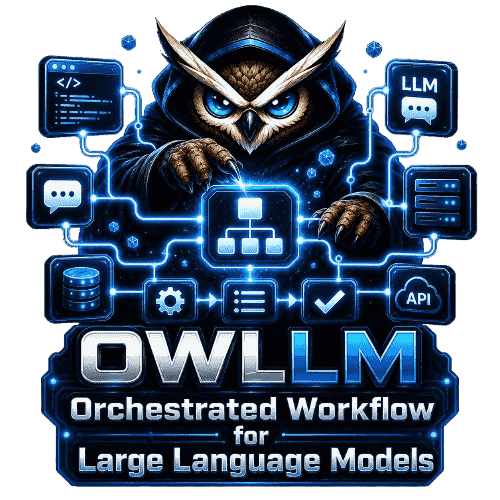

  
  
  
  

---

## What makes OwLLM different

Most AI tools give you a chatbox. **OwLLM gives you a workforce.**

You compose teams of specialised agents — an orchestrator that plans, a coder that writes, a critic that reviews, a researcher that fact-checks — and they collaborate on real tasks in parallel. Each team is a graph of roles + prompts you define. The 18 teams shipped in this repo are **starter samples**, not the menu.

| | What OwLLM gives you that others don't |
|---|---|
| 🧩 **Build your own teams** | Compose agents from 8 base roles + custom prompts. Visual graph builder. Hot-updates through this repo — push a team JSON, it lands on every installed app. |
| ☁️ **Cloud OR local — same teams** | No 4090? Plug in Claude / GPT / Gemini / Kimi keys, teams work identically. Have a GPU? Run open-weight models locally and stop paying per token. Mix both in the same conversation. |
| 🎓 **Fine-tune any model** | Full LoRA + Unsloth + TRL pipeline. Drop a JSONL, watch loss curves, save adapters. Works on consumer GPUs (8 GB+). |
| 🔬 **Abliterate for safety research** | Orthogonalise weights against refusal directions. Generate adversarial datasets. Train better safety classifiers. The honest tools the field actually needs. |
| 🛠 **GGUF + quantization built-in** | Convert HF safetensors → GGUF, quantize Q4/Q5/Q6/Q8/F16. Ship custom models anyone with llama.cpp can run. |
| 🛡 **Red-team capable** | Compose adversarial agent teams whose *job* is to find vulnerabilities — in models, code, apps. Pair with fine-tuning to train defenders. |
| 🔌 **MCP-first tooling** | Plug in any Model Context Protocol server (filesystem, git, browser, Postgres, GitHub, Brave…). Curated packs per team. |
| 🏠 **Run anywhere** | Desktop today. **Headless on a $5/mo VPS, 24/7** — on the roadmap. Containerised / VM — on the roadmap. Your agents, your hardware, your terms. |

## What teams can do

OwLLM ships starter teams in nine categories. **All of them are forkable and remixable** — they're templates, not the menu. The real product is the team builder.

| Category | What teams here do | Starter samples |
|---|---|---|
| 🛠 **Code** | Architect → code → critic → refactor; bug hunting; reviews | `code_artisan`, `dev_squad`, `code_reviewer`, `bug_hunter` |
| 🔬 **Research** | Multi-source synthesis with real citations, fact-checking | `research_lab`, `learning_tutor` |
| 📊 **Data** | SQL → notebook → viz → narrative | `data_analyst` |
| 🎨 **Design** | Product → UX → tech → critique | `product_studio` |
| ✍️ **Writing** | Outline → draft → edit → SEO → publish | `writers_room`, `social_desk` |
| 🤝 **Ops** | Triage → respond → schedule → digest | `secretary`, `concierge`, `customer_support` |
| 💼 **Personal** | Calendar, finance, health, home automation | `finance`, `health_coach`, `smart_home` |
| 🌐 **Social** | Outreach, support, community management | `sales_outreach`, `n8n_workflow_builder` |
| 🛡 **Safety / Red-team** | Adversarial dataset generation, jailbreak research, refusal probing | *(build your own — see [data/teams/SCHEMA.md](data/teams/SCHEMA.md))* |
| 🎮 **Gamify** | Agent-vs-agent, achievements, arena | *(in progress — Q4 2026)* |

[Browse the 18 starter teams →](data/teams/) · [Build your own →](CONTRIBUTING.md)

## Build your own team — 5-minute walkthrough

1. Open **Studio** in the desktop app
2. Drop in agents: orchestrator + 1..N specialists (coder, critic, researcher, brainstormer, devops, documentation, operator, …)
3. Wire the dispatch graph (orchestrator → coder → critic → back to orchestrator)
4. Write each agent's system prompt
5. Save → team appears in your picker
6. **Publish to the community** via PR against [`data/teams/`](data/teams/) — your team becomes one-click installable for every other user

## Power tools nobody else ships

### Fine-tune any open-weight model
LoRA pipeline with Unsloth, TRL, PEFT, bitsandbytes. Llama / Qwen / Mistral / Gemma — anything on HuggingFace. Live loss curves, graceful Stop preserves checkpoints, resume-from-checkpoint and resume-adapter both supported. Runs on a 12 GB GPU.

### Abliterate (refusal removal for safety research)
Orthogonalise weight matrices against refusal directions (the Labonne / Arditi technique, packaged). Use cases:
- AI safety labs training refusal classifiers need cleanly-uncensored teacher models
- Red teams need models that don't sandbag jailbreak tests
- Academic research on alignment failure modes

The corpus prep + abliteration script ship together.

### GGUF creation + quantization
Convert HF safetensors → GGUF, quantize to Q4_K_M / Q5_K_M / Q6_K / Q8_0 / F16. The same pipeline that gives you tiny, fast custom models others can run on llama.cpp / Ollama / LM Studio.

### Adversarial dataset generation
Build a team whose role is to PROBE another model. Output: a labelled dataset of jailbreak attempts, refusal patterns, edge cases. Sells to AI safety labs. Trains your own filters.

## Cloud or local — same teams, your choice

You don't need a 4090. Many users will never have one.

- **Cloud-only:** Plug in Claude / GPT / Gemini / Kimi API keys. Teams work identically. ~30 MB install, runs on any laptop.
- **Local + cloud mix:** Have a 3060? Run Llama for the bulk, hand off to Claude for the hard parts in the same conversation. Save 90% on tokens.
- **Local-only:** Have a 4090? Never touch a cloud API. Privacy by default. Stop paying per token forever.

Same teams. Same agent definitions. Same UI. The model layer is just plumbing.

## Run anywhere

| Mode | Status | Use case |
|---|:---:|---|
| **Desktop (Windows)** | ✅ shipped | Daily-driver AI workstation on your laptop |
| **Desktop (macOS / Linux)** | 🔜 Q3 2026 | Mac / Ubuntu users |
| **Headless on VPS (24/7)** | 🔜 Q4 2026 | Run your custom teams on a $5/mo box. Reach them via Telegram, web, API. Always-on agentic services. |
| **Containerised / VM** | 🔜 Q4 2026 | Drop OwLLM into your existing infra. |

The team definitions, role prompts, MCP configs, and model selections are all portable across deployment modes — build a team once, run it anywhere.

## Install (desktop)

1. **[Download](https://github.com/OwLLM/owllm/releases/latest)** the installer (~30 MB)
2. Run `OwLLM-Desktop-Setup-x64.exe`. Windows SmartScreen may flag it the first time (the binary isn't EV-signed yet) — click "More info" → "Run anyway".
3. On first launch, a **hardware-aware wizard** opens. It detects your hardware and offers the modules that fit:
   - **Local Inference** (~33 MB CPU / ~32 MB Vulkan / ~285 MB CUDA) — only needed if you want local models
   - **Audio / Speech-to-Text** (~148 MB) — for voice messages, mic input
   - **Fine-tuning** (~12 GB) — only if you'll train models
   - **MCP toolchain** (~260 MB) — only if you want browser / git / postgres MCP servers

**Cloud-only?** Skip the wizard entirely and just enter your API keys in Settings. The shell alone is enough for cloud-model chat + agent orchestration.

## How updates work

Three independent update streams — small, fast, no full reinstalls:

- **Shell** auto-updates via Tauri's signed updater
- **Modules** (llama backend, fine-tune env, audio, MCP) check + swap per-launch
- **Data layer** (team templates, role prompts, model profiles, MCP recommendations) hot-pulls from `data/` in this repo on launch. **A new team you contribute today reaches every installed app within minutes — no rebuild.**

That's why the data/ tree is open and community-driven even though the app binaries are closed-source.

## Roadmap

- [x] Multi-agent dispatch with worktree isolation
- [x] Modular installer + hardware-aware wizard
- [x] MCP-first tool architecture
- [x] Fine-tuning + abliteration pipeline
- [x] GGUF / quantization pipeline
- [x] Telegram bridge
- [ ] **Visual team builder** — Q3 2026
- [ ] **macOS + Linux desktop** — Q3 2026
- [ ] **24/7 headless / VPS mode** — Q4 2026
- [ ] **Container / VM deployment** — Q4 2026
- [ ] **Gamification** (agent-vs-agent arena, achievements) — Q4 2026 *(in progress)*
- [ ] **WhatsApp bridge** — Q4 2026
- [ ] **Vision models** (LLaVA / Pixtral) — Q4 2026
- [ ] **Voice output (TTS)** — Q1 2027
- [ ] **Public team marketplace** — Q1 2027

Track active work in [Discussions → Roadmap](https://github.com/OwLLM/owllm/discussions).

## Who's this for

- **Indie devs & founders** — your AI workforce, not a SaaS subscription
- **AI safety researchers** — abliteration, red-team teams, adversarial dataset gen
- **Model creators** — fine-tune, quantize, ship GGUFs
- **Automation builders** — replace n8n / Zapier with agents that understand *meaning*
- **Privacy-bound teams** — legal, medical, defence, regulated industries
- **Agencies** — run custom client agent teams 24/7 (when VPS mode lands)
- **Power users** — anyone tired of generic chatboxes

## Community

- 💬 [GitHub Discussions](https://github.com/OwLLM/owllm/discussions) — Q&A, show what you built, roadmap input
- 🐛 [Issues](https://github.com/OwLLM/owllm/issues) — bug reports (use the template)
- 🎨 [Contributing](CONTRIBUTING.md) — agent teams, roles, translations, docs

## License

Repository contents (agent teams, role definitions, registry, schemas, docs): [MIT](LICENSE) — fork freely, share team packs, build on it.

Application binaries via [Releases](https://github.com/OwLLM/owllm/releases): see [EULA.md](EULA.md). Source for the application itself is not currently public.

## Acknowledgements

Standing on the shoulders of: [llama.cpp](https://github.com/ggml-org/llama.cpp), [whisper.cpp](https://github.com/ggerganov/whisper.cpp), [Tauri](https://tauri.app/), [Unsloth](https://github.com/unslothai/unsloth), [Model Context Protocol](https://modelcontextprotocol.io/), and the open-weight model creators (Meta, Alibaba, Mistral, Google, DeepSeek, Anthropic for their safety research).

**If you build something cool with OwLLM, share it in [Discussions → Show & Tell](https://github.com/OwLLM/owllm/discussions/categories/show-and-tell).** Stars are how this category proves itself worth investing in.
