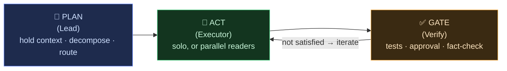
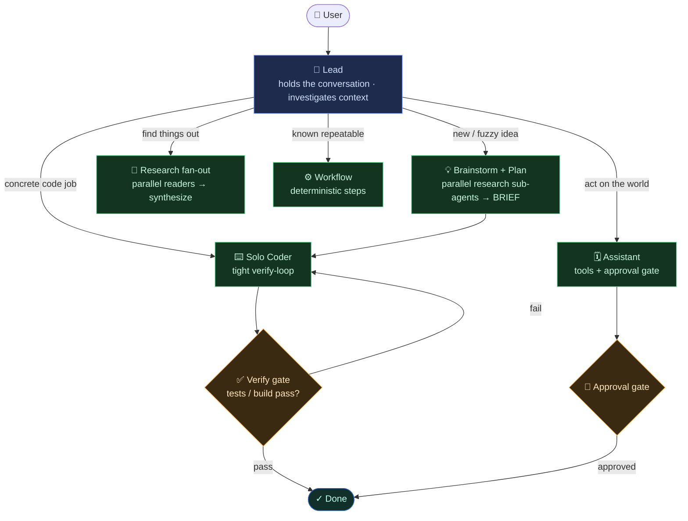
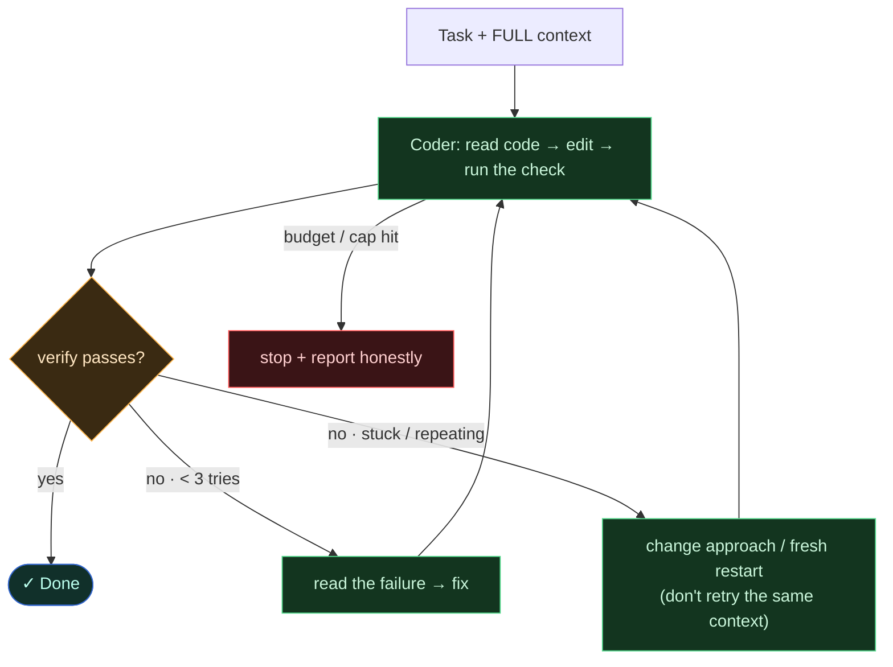
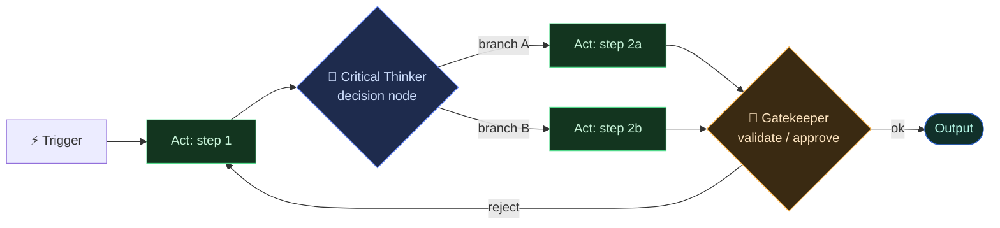

# OwLLM — Agentic Design & the Evidence Behind It

Why OwLLM's agents are built the way they are. Every choice here is anchored to
published research and real benchmarks, not vibes. Diagrams are
[Mermaid](https://mermaid.js.org/) — they render on GitHub and GitHub Pages.

> **The one principle:** *match the architecture to the task.* There is no single
> "best" agent shape — the **structure of the task** decides it. The whole system
> is three primitives, **composed differently per task type**.

---

## 1. The three primitives

Everything OwLLM does is a composition of just three things:

- **PLAN / Lead** — the single entity that holds the user conversation. It either
  *thinks with you* (brainstorm + plan a new idea) or *routes* a concrete job. One
  context owner, always.
- **ACT / Executor** — does the work. **Solo** for coupled work (coding), **parallel**
  for independent read-heavy work (research).
- **GATE / Verify** — the **grounded** check that decides "done." Critically, this is
  *not the model's own say-so* — it's an external signal whose form depends on the
  task (see §3). Self-reported "done" is wrong **up to ~76%** of the time on coding
  tasks ([False Success, 2026](https://arxiv.org/abs/2606.09863)).

---

## 2. Match the architecture to the task

The same primitives, composed for the task in front of you:

| Task type | Best shape | Primitive composition | Why (evidence) |
|---|---|---|---|
| **Coding / shipping** | **Solo agent + tight verify-loop** | `Act(solo) → Gate(tests/build)` | Multi-agent *degrades* SWE-bench (−2…−15%) at ~4× tokens; a ~100-line solo loop scores **>74%** ([mini-swe-agent](https://github.com/SWE-agent/mini-swe-agent)); a fixed pipeline beats agent frameworks ([Agentless](https://arxiv.org/abs/2407.01489)); "no architecture systematically wins, the model dominates" ([survey](https://arxiv.org/abs/2506.17208)). |
| **Research / discovery** | **Lead + parallel read sub-agents → synthesize** | `Plan → Act(parallel reads) → Gate(synthesis + citations)` | Multi-agent beat solo by **+90%** on breadth-first research ([Anthropic](https://www.anthropic.com/engineering/multi-agent-research-system)); each sub-agent compresses an independent slice in its own context. **Parallelize reads.** |
| **Personal assistant** | **Solo conversational + tools + approval gate** | `Act(tools) → Gate(human approval for side-effects)` | Tool-use loop ([ReAct](https://arxiv.org/abs/2210.03629)); gate by **risk × reversibility**, not by the agent's uncertainty (OpenAI/Anthropic agent guides). Can fan out *reads* (check 3 calendars) but **side-effects pass a gate**. |
| **Repeatable workflow (n8n-style)** | **Deterministic graph; LLM only at decision/validation nodes** | `fixed Act steps + CriticalThinker(decide) + Gatekeeper(validate)` | For a **known, repeatable** path, a workflow (predefined steps) is more reliable & cheaper than a free agent ([Anthropic: Building Effective Agents](https://www.anthropic.com/research/building-effective-agents)). Add intelligence only at branch/validation points. |
| **Open-ended / unknown** | **Agent — the Lead routes** | LLM-directed `Plan → Act → Gate` | Use an agent only when the path *isn't* knowable up front; otherwise prefer a workflow. |

**The unification (your insight, generalized):** a **workflow is just a fixed
composition of the primitives** — the control flow is decided in advance. An
**agent is an LLM-decided composition** — the control flow is chosen at runtime.
Same parts; "workflow vs agent" is only *who picks the path.*

And the **Gate is one primitive with different concrete checks:** tests/build for
code · human approval for world-actions · citation/fact-check for research · a
validation node for a workflow. Whatever the form, it's an **external** signal —
never the executor grading itself ([self-correction degrades without an oracle](https://arxiv.org/abs/2310.01798)).

---

## 3. The Lead — one front door that brainstorms *or* routes

- The Lead **decides the mode in context** (smarter than a keyword classifier), and
  you can always override (*"just do it"* / *"let's plan first"*).
- It **routes**; it does **not** do the work itself — the executor explores the code
  (a read-only planner handing blind tickets to a blind executor is *the* documented
  failure mode — [Cognition](https://cognition.ai/blog/dont-build-multi-agents)).
- **Verification is independent of the Lead.** The Lead owns the plan, so it can't be
  the judge of it — the **Gate** (tests) is the judge.

---

## 4. The coding loop (where solo wins)

Loop rules, all evidence-backed:
- **Close on tests, not self-report.** Set `.owllm/verify.json` `{"command":"npm run build"}`; OwLLM runs it and the Run Report shows **✓ / ✗** (shipped v0.6.78).
- **Cap at ~2–3 fix rounds** — they capture 76–95% of achievable gains; more plateaus or decays.
- **Break a stuck loop by *changing context* / restarting**, not retrying — the loop is the model pattern-continuing what's already there. Step-repetition is the **#1** multi-agent failure ([MAST](https://arxiv.org/abs/2503.13657)).
- **Don't feed failed attempts back** — agents re-condition on their own errors ([Context Rot](https://www.trychroma.com/research/context-rot) / self-conditioning).

---

## 5. A workflow IS the primitives (deterministic composition)

An n8n-style workflow is **fixed-path** (cheap, reliable, for known processes), with
LLM intelligence inserted only where it's needed: a **Critical Thinker** at a branch
and a **Gatekeeper** at a validation/approval point. The Lead *runs* a workflow for a
known repeatable job, and falls back to a *free agent* only when the path is unknown.

---

## 6. Scientific background (load-bearing sources)

**Architecture.** Single-agent baselines are strong: [Agentless](https://arxiv.org/abs/2407.01489), [mini-swe-agent](https://github.com/SWE-agent/mini-swe-agent), [SWE-bench leaderboard survey](https://arxiv.org/abs/2506.17208). Multi-agent helps for breadth-first/parallel work: [Anthropic multi-agent research system](https://www.anthropic.com/engineering/multi-agent-research-system); and its limits/failures: [Cognition — Don't Build Multi-Agents](https://cognition.ai/blog/dont-build-multi-agents), [MAST](https://arxiv.org/abs/2503.13657). Workflow-vs-agent: [Anthropic — Building Effective Agents](https://www.anthropic.com/research/building-effective-agents).

**The loop.** [ReAct](https://arxiv.org/abs/2210.03629), [CodeAct](https://arxiv.org/abs/2402.01030), [SWE-agent](https://arxiv.org/abs/2405.15793). Verification is the spine: [Self-Debug](https://arxiv.org/abs/2304.05128), [Reflexion](https://arxiv.org/abs/2303.11366); and its limits: [LLMs Cannot Self-Correct Reasoning Yet](https://arxiv.org/abs/2310.01798), [When Can LLMs Actually Correct Their Own Mistakes? (TACL 2024)](https://arxiv.org/abs/2406.01297), [False Success](https://arxiv.org/abs/2606.09863).

**Context.** [Lost in the Middle](https://arxiv.org/abs/2307.03172), [Context Rot](https://www.trychroma.com/research/context-rot), [Anthropic — Effective context engineering](https://www.anthropic.com/engineering/effective-context-engineering-for-ai-agents).

**Sampling.** Low temp / greedy for code: [The Good, the Bad, and the Greedy](https://arxiv.org/abs/2407.10457). (Note: newer Claude models manage their own sampling — temperature is a local-model knob.)

---

## 7. Status

| Piece | State |
|---|---|
| Grounded verify gate (`.owllm/verify.json`) | ✅ shipped (v0.6.78) |
| Bias-to-action contract (decide reversible forks; ask only on goal ambiguity) | ✅ shipped (v0.6.78) |
| No self-conditioning (failed turns excluded from shared memory) | ✅ shipped (v0.6.78) |
| Lead front-door (brainstorm-or-route, single interface) | 🚧 proposed |
| Solo-coder verify-loop as the default coding path | 🚧 proposed |
| Executor explores code (no blind-ticket handoff) + full-trace handoff | 🚧 proposed |
| Verify auto-run *inside* the coder loop (fix red itself) | 🚧 proposed |

*This document is the rationale; the implementation lands incrementally, each piece
proposed before it's built.*
