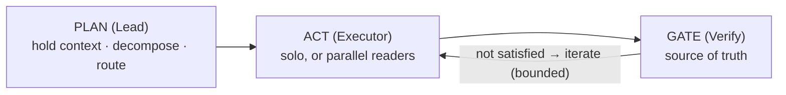
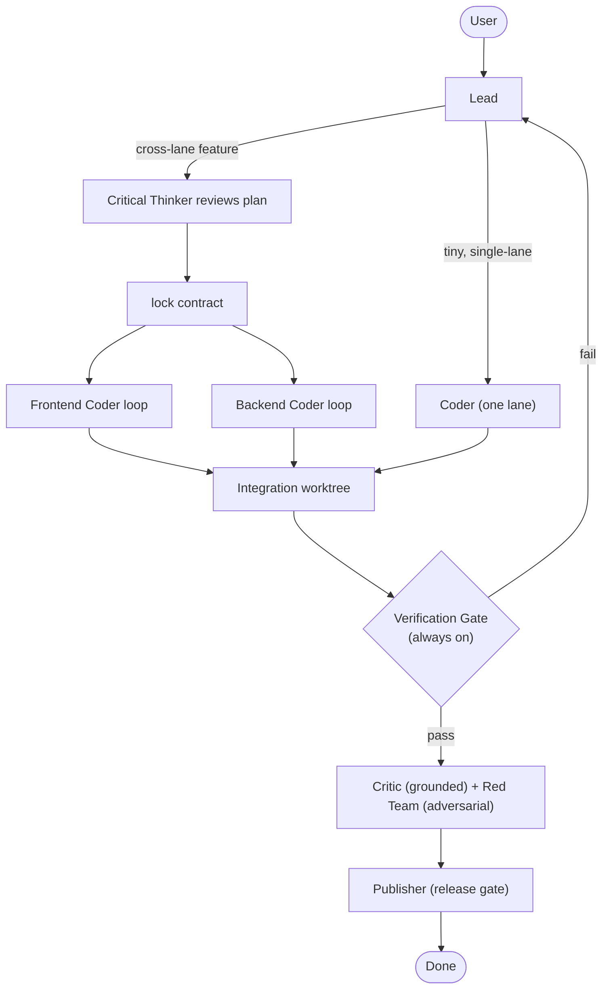
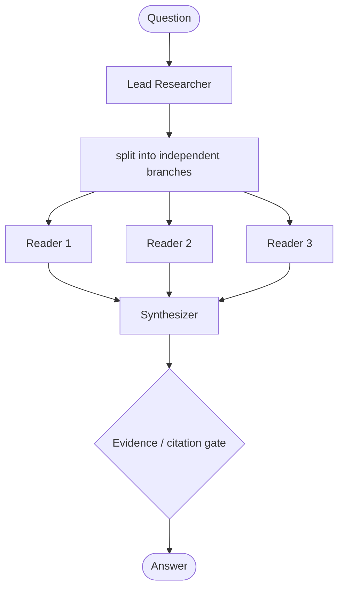
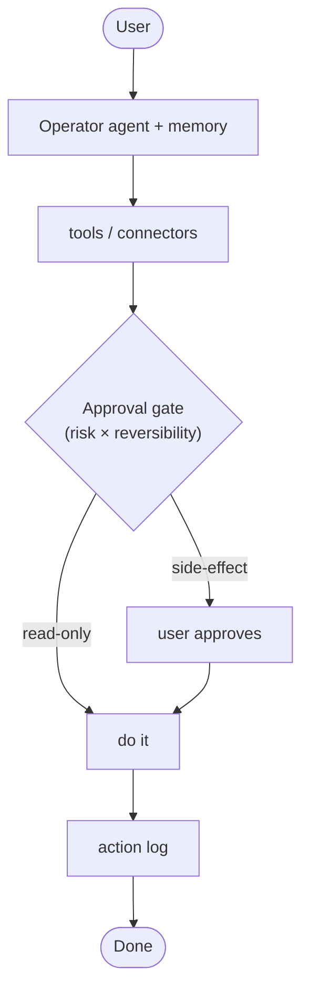
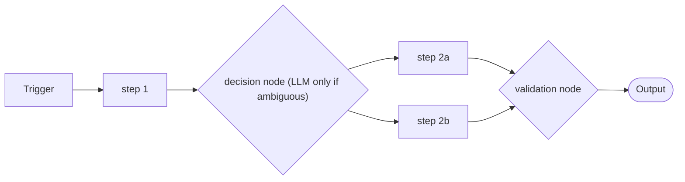

# OwLLM — Agentic Architecture (4 Adaptive Shapes)

**One engine → 4 adaptive shapes → many presets → smallest safe activation per task.**
Not 18 bespoke teams; not one generic swarm forced onto every task. Every choice
here is anchored to published research (see §9). Diagrams are
[Mermaid](https://mermaid.js.org/) (render on GitHub / Pages).

## 1. The principle
> **Isolate implementation. Share contracts. Run scoped, grounded agent loops. Verify integration.**
>
> *Loops make each agent reliable. Contracts make a team coherent. Tests — not debate — decide truth. The Lead decides how much team to wake up.*

## 2. Three primitives

- **PLAN / Lead** — the single context owner; brainstorm-or-route; sizes the ceremony to the task.
- **ACT / Executor** — solo for coupled work, parallel for independent reads.
- **GATE** — the *grounded* check that decides "done." The executor never grades itself (self-reported "done" is wrong up to ~76% on coding tasks).

**Every shape has a source-of-truth gate:**

| Shape | Gate |
|---|---|
| Build | tests / build pass |
| Research | citations / evidence supported |
| Assistant | user approval |
| Workflow | validation node |

*(Internally it's one Gate abstraction with these four implementations.)*

## 3. Memory tiers
| Tier | Holds | Scope |
|---|---|---|
| 1. Private role memory | lane knowledge (UI patterns / API changes…) | per agent |
| 2. Shared contract memory | cross-boundary truths (endpoints, schemas, types, env, auth, error codes, acceptance criteria) | shared |
| 3. Live blackboard | current structured state (phase, worktrees, statuses, blockers, required tests) | shared, live |
| 4. Decision log | locked decisions + supersedes (stops reviving wrong ideas) | shared |
| 5. Verified artifact store | real diffs, test/build logs, reports | shared, append-only |

*Rule: share the **contract**, isolate the **implementation**, and never store an agent's claim of success — store the captured command output.*

## 4. Shape vs roles — two different decisions
- **Shape is *selected*, not guessed** — it comes from the preset the user opens (code repo → Build; "finance assistant" → Assistant). Deterministic, low-risk.
- **Roles are *activated*** by the Lead within a shape — a forgiving guess, because the **Gate auto-escalates** when you under-activate (verify fails → wake the missing role).

## 5. The four shapes

### A. Build — coding, apps, bugs, releases

- Always present: **Lead + Verification Gate**. Activated when needed: Frontend, Backend, Tester, Critic, Red Team, Publisher; Critical Thinker at the plan stage.
- Scales **down** (tiny edit = Lead → one Coder → Gate) and **up** (feature = contract → parallel lanes → integration → review → publish).
- Presets: `dev_squad`, `code_artisan`, `bug_hunter`, `code_reviewer`, `product_studio`.

### B. Research — discovery, analysis (the clearest place multi-agent parallelism can win)

- Parallel independent readers (own context each) → synthesize → citation gate. The gate here is the *softest*: output is **"evidence-backed," not "verified-correct"** — you can't *execute* a research answer.
- Presets: `research_lab`, `data_analyst`.

### C. Assistant — calendars, messages, APIs, domains

- Solo conversational + tools + **approval gate** (human approval for side-effects; reads just happen) + action log. Fans out *reads*, never *writes*.
- Presets: `concierge`, `secretary`, `customer_support`, `sales_outreach`, `smart_home`, `health_coach`, `finance`, `learning_tutor`, `social_desk`, `writers_room`.

### D. Workflow — known, repeatable jobs

- Deterministic first; LLM only where ambiguity requires. For known paths this beats a free agent (cheaper, reliable).
- Presets: `n8n_workflow_builder`, document/email/report pipelines.

## 6. Nested loops + budgets
`Lead loop → per-agent scoped loops → tool/verify loops.` Each loop has a budget; **no debate loops** (opinion→opinion drifts via sycophancy). The danger is multiple *rounds within a stage*; distinct stages are fine. Primary exit is **no-progress** ("same error twice"), not the iteration cap.

## 7. Reviewers (three stages, one pass each)
- **Critical Thinker** — upstream, talks only to the Lead: pressure-tests the *plan/contract* before code; stands in for the user as **super-user** when you're away (decisive, grounded in project rules).
- **Critic** — downstream, with the agents: reviews *work/diffs*, **grounded on the verify output**, one pass, never a coder↔critic loop.
- **Red Team** — adversarial *verifier*: tries to break it (security/abliteration), reports what actually broke.

## 8. The 18 → 4 mapping
Coding teams → **Build** presets. `research_lab`/`data_analyst` → **Research**. The domain assistants → **Assistant** presets. `n8n_workflow_builder` → **Workflow**. Shapes are *code* (4); presets are *thin data* (tools/prompt/permissions/memory) — never copies of shape logic.

## 9. Evidence
Single-agent strength: Agentless, mini-swe-agent (>74% SWE-bench), SWE-bench survey. Multi-agent for research: Anthropic multi-agent system (+90%, ~15× tokens). Limits/failures: Cognition "Don't Build Multi-Agents", MAST (inter-agent misalignment 36.9%). Verification: Self-Debug, Reflexion; and its limits: "LLMs Cannot Self-Correct Reasoning Yet", "False Success" (~76%). Context: Lost in the Middle, Context Rot. Workflow-vs-agent: Anthropic "Building Effective Agents".

## 10. Build order (the Gate is the foundation)
Build the **Verification Gate first** — once it exists, every later agent has a source of truth. Then: verify.json discovery → honest "unverified" state → captured output → coder loop uses the Gate → structured handoff → Lead activation table → contract lock → integration worktree → grounded Critic. **Do not collapse the old coding teams until the Gate + coder loop work.**

## 11. Positioning
> OwLLM runs **adaptive agent shapes, not fixed swarms.** A small edit behaves like a fast solo coder; a complex feature expands into a coordinated build team with shared contracts, scoped loops, verification, review, and publishing. The same engine powers research (parallel investigators), assistants (tools + approval), and workflows (deterministic steps).
>
> **One engine. Four adaptive shapes. Only the agents you need.**
> *Private memory for the lane. Shared memory for the contract. Verified memory for the truth.*

## 12. Status
| Piece | State |
|---|---|
| Grounded verify gate (`.owllm/verify.json`) | ✅ first cut shipped (v0.6.78); formalizing into a first-class Gate (slice 1) |
| Bias-to-action contract · no self-conditioning | ✅ shipped (v0.6.78) |
| 4-shape model + presets | 📐 adopted (this doc) |
| Build Shape: Lead + Gate + activation + per-agent loop | 🚧 slice 1 (in progress) |
| Research / Assistant / Workflow shapes | 🚧 next |
