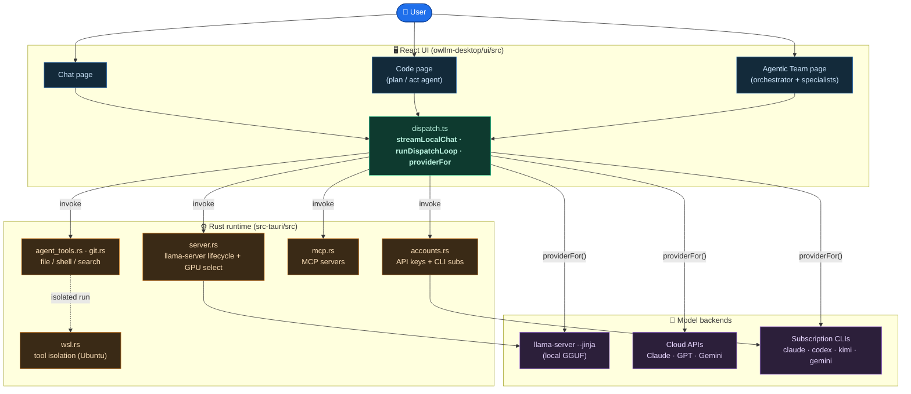
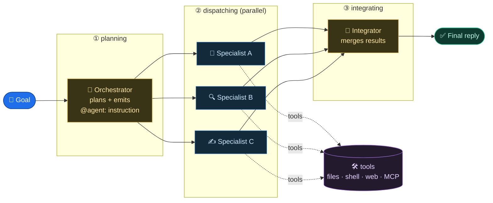
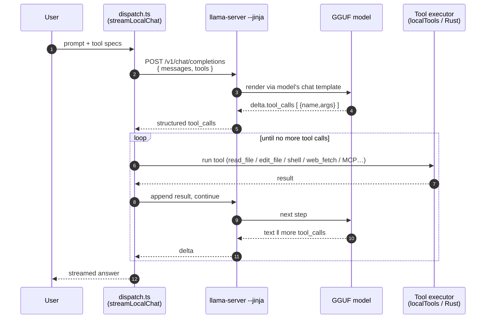
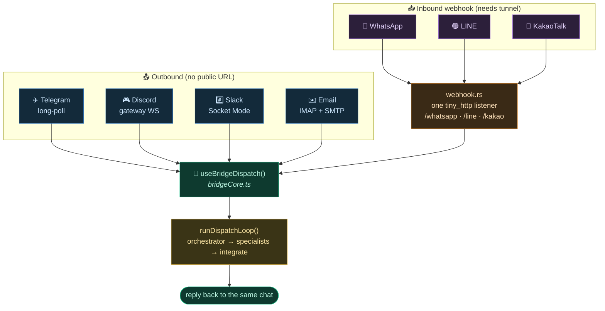
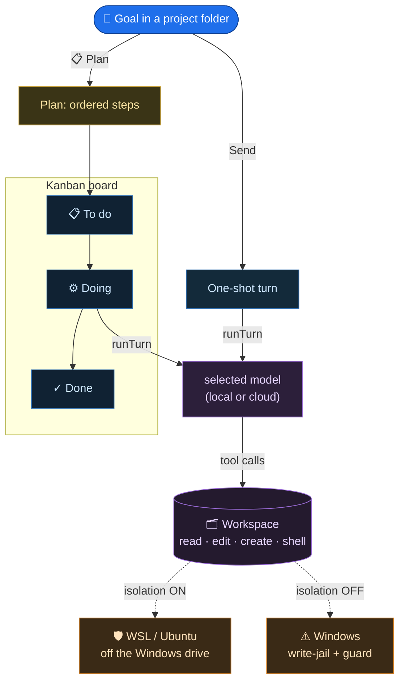
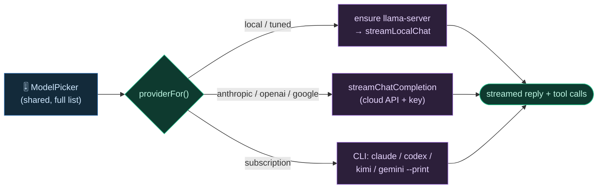

# OwLLM — Agentic Architecture

How OwLLM Desktop turns a goal into work done by a team of local/cloud models
with real tools. Diagrams are [Mermaid](https://mermaid.js.org/) — they render
on GitHub and in the VS Code *Markdown Preview Mermaid* extension.

- **Rust** owns the runtime (model lifecycle, hardware, tools, bridges).
- **React** owns the UI and the agentic dispatch logic, talking to Rust via `invoke()`.
- **Tool-calling is native GGUF only** — the OpenAI `tools` array is rendered by
  the model's own chat template (`llama-server --jinja`) and read back as
  structured `delta.tool_calls`. No XML, no prompt-injected tool catalog.

---

## 1. System overview

---

## 2. The agentic dispatch loop

`runDispatchLoop()` runs three phases: the **orchestrator** plans and fans work
out to **specialists** (in parallel), then an **integrator** pass synthesizes
one answer. Every model call is the same `streamLocalChat` / `streamChatCompletion`.

---

## 3. Native GGUF tool-calling (one turn)

No XML. The OpenAI `tools` array goes to `llama-server --jinja`, which renders it
through the GGUF's own chat template; the reply comes back as structured
`delta.tool_calls`, the executor runs them, results are fed back, repeat until
the model stops calling tools.

---

## 4. Messaging bridges — drive the team from anywhere

Seven bridges fan into **one** shared `useBridgeDispatch()` core, so they all
share the same commands, project routing, attachments and desktop mirror.
**Outbound** bridges work on any machine; **inbound webhook** bridges need a
public URL (a tunnel).

---

## 5. Code page — plan / act coding agent

The Code page runs a single model directly against a project folder. **Plan**
breaks a goal into ordered steps shown on a Kanban board; **Send** does a
one-shot. Tools run in the workspace — inside **WSL (Ubuntu)** when isolation is
on, otherwise on Windows behind a write-jail + dangerous-command guard.

---

## 6. Provider routing — one dispatch, three backends

`providerFor(modelId)` decides how each turn runs. The UI (model picker) is the
same everywhere; only execution differs.

---

### Source map

| Concern | File |
|---|---|
| Shared dispatch (local + cloud + loop) | `ui/src/pages/agentic/dispatch.ts` |
| Tool specs + MCP tools | `ui/src/pages/agentic/localTools.ts` |
| Bridge core (one dispatch for all) | `ui/src/bridges/bridgeCore.ts` |
| Per-bridge runners | `ui/src/bridges/*BridgeRunner.tsx` |
| Inbound webhook server | `src-tauri/src/webhook.rs` |
| llama-server lifecycle + GPU | `src-tauri/src/server.rs` |
| Tools (Rust) | `src-tauri/src/agent_tools.rs`, `git.rs` |
| WSL isolation | `src-tauri/src/wsl.rs` |
